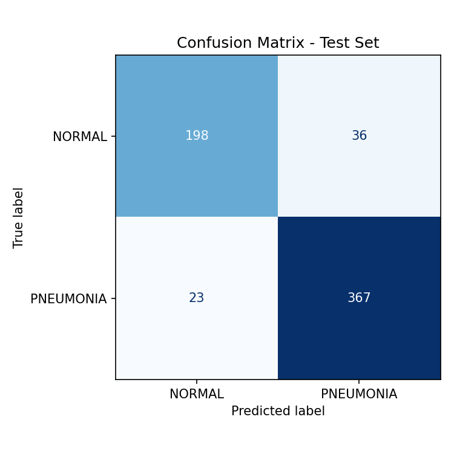
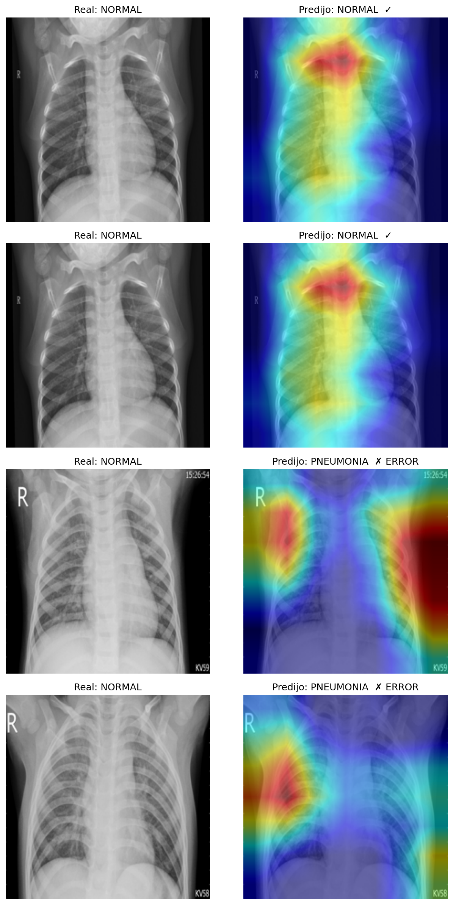

# Chest X-Ray Pneumonia Classifier

Transfer learning (ResNet18) to classify chest X-rays as **NORMAL** or **PNEUMONIA**, with a focus on **rigorous evaluation and failure-mode analysis** using Grad-CAM.

## Key results (test set, 624 images)

| Class | Precision | Recall | F1 |
|-----------|----------:|-------:|-----:|
| NORMAL | 0.94 | 0.79 | 0.86 |
| PNEUMONIA | 0.88 | 0.97 | 0.93 |

**Accuracy: 0.90** · Only **11 false negatives** out of 390 pneumonia cases (recall 0.97).

## Why recall matters here

In a medical context, a **false negative** (telling a sick patient they are healthy) is far more costly than a false alarm. The model was trained with **class weights** to compensate the 1:2.9 class imbalance and prioritize recall on the PNEUMONIA class — a deliberate trade-off: high recall on disease (0.97), at the cost of more false positives on healthy cases (recall 0.79).

## Failure-mode analysis with Grad-CAM

I used Grad-CAM to verify **where the model looks** when it makes a decision.

**Finding:** On correct predictions, attention concentrates on central lung / mediastinal regions. On **false positives**, however, the model's attention drifts toward the **image borders** rather than lung tissue — suggesting it learned spurious shortcuts related to image framing/acquisition rather than actual pathology.

**Proposed mitigations:** lung segmentation/cropping to focus on the region of interest, stronger edge augmentation, and cross-source validation to rule out domain bias.

## Data

- Dataset: Chest X-Ray Images (Pneumonia), Kermany et al. (Kaggle).
- The original validation split had only 16 images; I re-split train+val (85/15, seed=42) for a reliable validation set of 784 images. Test set left untouched (624 images).

## Stack

Python, PyTorch, torchvision (ResNet18), scikit-learn (metrics), pytorch-grad-cam, Google Colab (T4 GPU).

## Notes

The trained model (`.pth`, ~45 MB) is not versioned here; the full training pipeline is reproducible from the notebook in `notebooks/`.

## Author

**Natalia Becerra Villada** — Physics Engineer | ML / Deep Learning
[LinkedIn](https://www.linkedin.com/in/natalia-becerra-villada) · [GitHub](https://github.com/NataliaBV1)